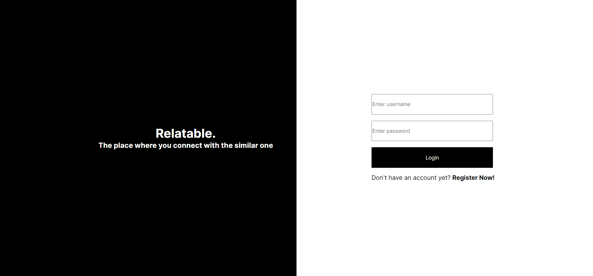
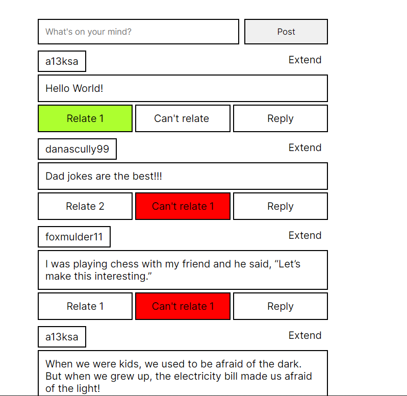
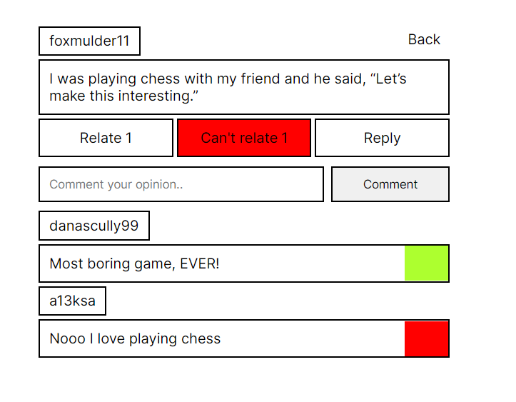

# Relatable.
Social Network
Login - Register, Posts - Like, Dislike, Comment.

### Login Page
When we open our website, first we need to login or in case we don't have account we must register.

### Feed
Feed is place where we can read and share relatable moments.

### Single Post
On feed we are limited to just relate to post, but when we extend post, we can comment and read comments of others.
Comments contain our opinion, and before commenting we need to relate so comment can be positive or negative.
That is the reason behind Relate and Can't Relate, commenting about your opinion on someone else's thoughts.  

